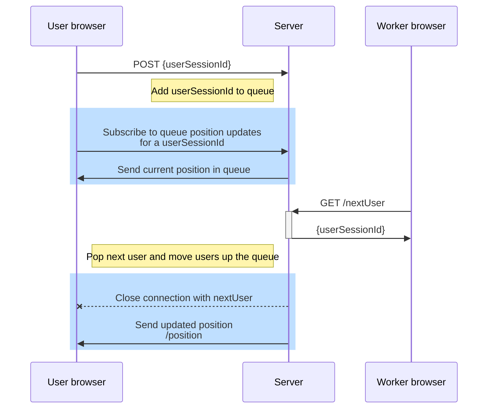

## Real Time Queue Service

### Diagram



### Core traits

```scala 3

trait QueueService[F[_]] {
  def addUser(userSessionId: UserSessionId): F[Unit]
  // add user to queue
  def nextUser: F[Option[UserSessionId]]
  // pop next user from queue and update positions
  // send updates to users
  def removeUser(userSessionId: UserSessionId): F[Unit]
  // remove a particular user from queue when user browser closes connection
  // update positions in the queue
  // send updates to users
  def getCurrentPosition(userSessionId: UserSessionId): F[Option[Int]]
  // is this needed?
  def subscribeToUpdates: Stream[F, Int]
  // subscribe to updates for latest served position
}

// Alternative:
trait UserService[F[_]] {
  def addUserAndSubscribe(userSessionId: UserSessionId): Stream[F, Int]
  // browser calls this to join the queue and automatically subscribe
  // browser receive current position and further udpates
  def closeConnection(userSessionId: UserSessionId): F[Unit]
  // browser calls this to leave the queue
  // remove this user and update the positions of the users in the queue 
  // send updated positions to users
}

trait WorkerService[F[_]] {
  def getNextUser: F[Option[UserPosition]]
  // worker calls this to get the next user in the queue
  // remove next user and update the positions of the users in the queue 
  // send updated positions to users
  // terminate user session
}

UserPosition(UserSessionId, Position)

Queue[F, UserSessionId] // Queue of userSessionId
Seq(UserPosition)
MapRef[F, UserSessionId, Position] // Map of userSessionId and position in queue
//MapRef[F, UserSessionId, Signal]
Topic[F, (UserSessionId, Int)] // Topic of userSessionId and position in queue
    // one topic for each user? 
// remove particular user 
// broadcast position for sessionID


```